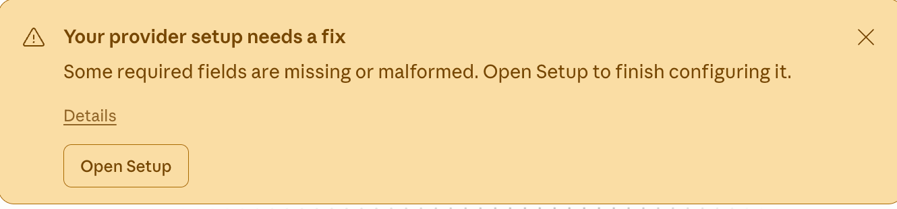

# cd-proxy

[中文文档](README.zh.md)

Anthropic API proxy that routes requests to configurable third-party Anthropic-compatible backends. macOS menu bar app with a built-in web dashboard for configuration, monitoring, and live request logs.

## Background

When configuring a third-party model in the latest Claude Desktop, it reports an API key error and refuses to work:



cd-proxy solves this by acting as a local proxy — Claude Desktop sends requests to `localhost` using official Anthropic model names, and cd-proxy transparently forwards them to any Anthropic-compatible backend (DeepSeek, etc.) with the correct API key and model name rewriting.

**Use case**: configure official Anthropic model names in Claude Desktop, point the base URL at cd-proxy, and it forwards to DeepSeek, or any other provider that speaks the Anthropic Messages API — no code changes needed in Claude Desktop.

## Features

- **Protocol-preserving** — no translation, just routing. Works with any upstream that supports the [Anthropic Messages API](https://docs.anthropic.com/en/api/messages)
- **Model rewriting** — map `claude-sonnet-4-20250514` to `deepseek-v4-pro` (or any name)
- **Per-model upstreams** — each model can have its own URL, API key, and name override
- **Default catch-all** — requests for unknown models fall through to a configurable default upstream
- **SSE streaming** — full streaming support relayed in real time
- **Hot reload** — config changes via the web UI take effect immediately, no restart needed
- **Live log viewer** — SSE-based real-time request logs in the dashboard with filtering
- **Config import/export** — YAML-based, works with any text editor
- **CORS support** — configurable allowed origins for browser-based API consumers
- **Headless mode** — `--headless` runs a pure CLI server (no menu bar, no web UI)
- **Single binary** — everything is embedded, including the web dashboard (no npm, no runtime deps)

## Quick start

Download the latest `.dmg` from [releases](https://github.com/example/cd-proxy/releases), mount it, and drag `cd-proxy.app` to `/Applications`.

On first launch, cd-proxy creates a default config at `~/.config/cd-proxy/config.yaml`. **Edit your API key** in the web dashboard (click "Open Dashboard" in the menu bar), or edit the file directly.

The proxy listens on `:48271` by default. Point your agent's base URL at `http://localhost:48271` and start making requests.

## Configuration

```yaml
listen: ":48271"
upstream_timeout: 120s
upstream_connect_timeout: 10s

default:
  url: "https://api.deepseek.com/anthropic/v1/messages"
  api_key: "sk-your-api-key"
  model_name: "deepseek-v4-pro"

models:
  - name: "claude-sonnet-4-20250514"
    upstream:
      url: "https://api.deepseek.com/anthropic/v1/messages"
      api_key: "sk-your-api-key"
      model_name: "deepseek-v4-pro"
  - name: "claude-opus-4-20250514"
    upstream:
      url: "https://api.openai.com/v1/messages"
      api_key: "sk-openai-key"
      model_name: "gpt-5"

cors:
  enabled: true
  allowed_origins: ["*"]
```

- **`listen`** — proxy listen address (default `:48271`)
- **`upstream_timeout`** — total upstream request timeout (default `120s`)
- **`upstream_connect_timeout`** — TCP/TLS handshake timeout (default `10s`)
- **`default`** — catch-all upstream for models not in the explicit list. If omitted, unknown models return a 400 error listing available models
- **`models`** — per-model routing. `model_name` rewrites the `model` field in the request body; leave empty to pass through unchanged
- **`cors`** — browser CORS settings for the proxy endpoint (not the admin dashboard)

## Build from source

### Unified build script

```bash
bash scripts/build.sh darwin    # macOS: .app + .dmg
bash scripts/build.sh windows   # Windows: .exe
bash scripts/build.sh all       # Both
```

### Manual build

```bash
# macOS (menu bar app, requires CGO)
go build -o cd-proxy .

# Windows (auto-open browser, no CGO needed)
GOOS=windows GOARCH=amd64 go build -ldflags="-s -w" -o cd-proxy.exe .

# Linux (auto-open browser, no CGO needed)
GOOS=linux GOARCH=amd64 go build -ldflags="-s -w" -o cd-proxy .
```

## Usage

### macOS — Menu bar app

```bash
./cd-proxy                           # menu bar app, uses default config
./cd-proxy -config ./my-config.yaml  # custom config path
./cd-proxy -proxy-addr :9090         # custom proxy port
./cd-proxy -admin-addr :9091         # custom admin dashboard port
```

Click the menu bar icon to access the dashboard, start/stop the proxy, or quit.

### Windows / Linux — Auto-open dashboard

```bash
# Windows
cd-proxy.exe

# Linux
./cd-proxy
```

Starts proxy + admin server, then automatically opens the browser to the web dashboard. Press Ctrl+C to shut down.

### Headless mode (all platforms)

```bash
# macOS
./cd-proxy --headless

# Windows
cd-proxy.exe --headless
```

Runs both the proxy and admin server without opening a browser, blocks until Ctrl+C.

## Dashboard

The web dashboard is served on the admin port (`:59183` by default, open `http://localhost:59183`). It provides:

| Page | What it does |
|------|-------------|
| **Dashboard** | Proxy status, uptime, request count, active models |
| **Models** | CRUD table for per-model upstream routes |
| **Default Upstream** | Configure the catch-all fallback upstream |
| **Settings** | Listen address, timeouts, CORS |
| **Logs** | Real-time SSE log stream with level/method/model filters |
| **Import/Export** | YAML config file import and download |

## API

### Admin API (port 59183)

| Method | Path | Description |
|--------|------|-------------|
| `GET` | `/api/status` | Proxy running state, uptime, request count |
| `GET` | `/api/config` | Current config (API keys masked) |
| `PUT` | `/api/config` | Update config (partial merge, hot reload) |
| `GET` | `/api/logs` | SSE stream of request logs |
| `GET` | `/api/logs/recent` | Last N log entries as JSON |
| `POST` | `/api/config/import` | Import YAML config |
| `GET` | `/api/config/export` | Download current config as YAML |
| `/` | — | Embedded web dashboard |

### Proxy API (port 8080)

| Method | Path | Description |
|--------|------|-------------|
| `POST` | `/v1/messages` | Anthropic Messages API (streaming/non-streaming) |
| `GET` | `/health` | Health check |

## Request flow

```
Client (agent tool)
  │  POST /v1/messages  {"model":"claude-sonnet-4-20250514", ...}
  ▼
cd-proxy (:48271)
  │  extract model → resolve upstream → rewrite model name → add API key
  ▼
Upstream (DeepSeek, OpenAI, etc.)
  │  POST .../anthropic/v1/messages  {"model":"deepseek-v4-pro", ...}
  ▼
cd-proxy ← SSE stream or JSON response
  │
  ▼
Client (agent tool)
```
