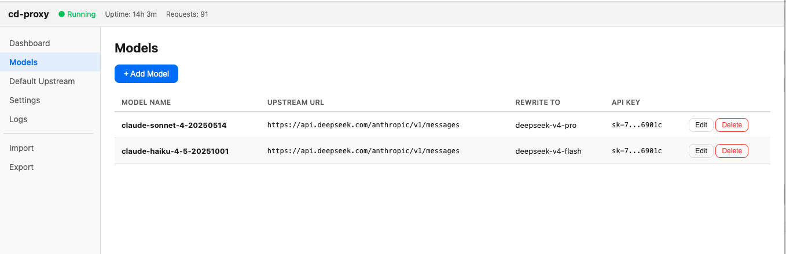
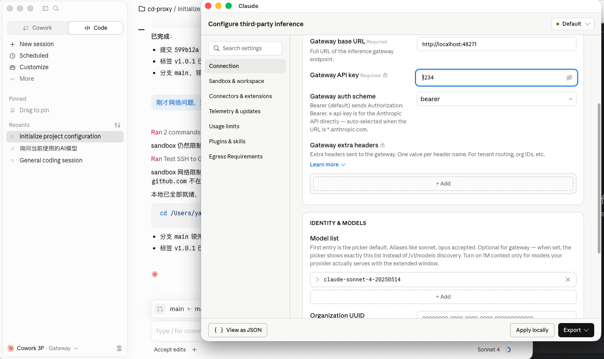

# cd-proxy

[English](README.md)

Anthropic API 代理转发工具，将请求路由到兼容 Anthropic 协议的第三方后端。macOS 菜单栏应用，内置 Web 管理面板，支持可视化配置、运行监控和实时请求日志。

## 背景

最新版 Claude Desktop 配置第三方模型时，会报错，无法直接使用：


cd-proxy 通过本地代理解决这个问题——Claude Desktop 以官方模型名向 `localhost` 发送请求，cd-proxy 透明地将其转发到任意兼容 Anthropic 协议的后端（DeepSeek 等），同时替换 API Key 和改写模型名。

**使用场景**：在 Claude Desktop 中配置 Anthropic 官方模型名称，将 Base URL 指向 cd-proxy，代理会自动转发到 DeepSeek 或其他支持 Anthropic Messages API 的供应商——agent 无需任何代码改动。





## 功能特性

- **协议透传** — 不做协议转换，纯转发。兼容任何支持 [Anthropic Messages API](https://docs.anthropic.com/en/api/messages) 的上游
- **模型名改写** — 将 `claude-sonnet-4-20250514` 映射为 `deepseek-v4-pro`（或任意名称）
- **按模型路由** — 每个模型可配置独立的 URL、API Key 和模型名改写
- **默认兜底** — 未匹配的模型自动走默认上游，也可禁用以严格限制可用模型列表
- **SSE 流式** — 完整支持 streaming 实时转发
- **热重载** — 通过 Web UI 修改配置立即生效，无需重启
- **实时日志** — 基于 SSE 的实时请求日志，支持 level/method/model 过滤
- **配置导入导出** — YAML 格式，兼容文本编辑器手动编辑
- **CORS 支持** — 可为浏览器端 API 调用配置跨域白名单
- **无头模式** — `--headless` 以纯 CLI 服务运行（无菜单栏、无 Web UI）
- **单二进制** — 所有资源（含 Web 管理面板）内嵌编译，无 npm 依赖，无运行时依赖

## 快速开始

从 [releases](https://github.com/example/cd-proxy/releases) 下载最新 `.dmg`，双击挂载后将 `cd-proxy.app` 拖入 `/Applications`。

首次启动会自动在 `~/.config/cd-proxy/config.yaml` 创建默认配置文件。在菜单栏中点击 "Open Dashboard" 打开管理面板修改 API Key，或直接编辑配置文件。

代理默认监听 `:48271`。将 agent 的 Base URL 设为 `http://localhost:48271` 即可开始使用。

## 配置说明

```yaml
listen: ":48271"
admin_listen: ":59183"
upstream_timeout: 120s
upstream_connect_timeout: 10s

default:
  url: "https://api.deepseek.com/anthropic/v1/messages"
  api_key: "sk-your-api-key"
  model_name: "deepseek-v4-pro"

models:
  - name: "claude-sonnet-4-20250514"
    upstream:
      url: "https://api.deepseek.com/anthropic/v1/messages"
      api_key: "sk-your-api-key"
      model_name: "deepseek-v4-pro"
  - name: "claude-opus-4-20250514"
    upstream:
      url: "https://api.openai.com/v1/messages"
      api_key: "sk-openai-key"
      model_name: "gpt-5"

cors:
  enabled: true
  allowed_origins: ["*"]
```

- **`listen`** — 代理监听地址（默认 `:48271`）
- **`upstream_timeout`** — 上游请求总超时（默认 `120s`）
- **`upstream_connect_timeout`** — TCP/TLS 握手超时（默认 `10s`）
- **`default`** — 未命中 models 列表时的兜底上游。不配置则对未知模型返回 400 并列出可用模型
- **`models`** — 按模型路由。`model_name` 用于改写请求体中的 `model` 字段；留空则透传原始模型名
- **`cors`** — 代理端口的浏览器跨域设置（不影响管理面板）

## 从源码构建

### 统一构建脚本

```bash
bash scripts/build.sh darwin    # macOS: .app + .dmg
bash scripts/build.sh windows   # Windows: .exe
bash scripts/build.sh all       # 全部构建
```

### 手动构建

```bash
# macOS（菜单栏应用，需要 CGO）
go build -o cd-proxy .

# Windows（自动打开浏览器，无需 CGO）
GOOS=windows GOARCH=amd64 go build -ldflags="-s -w" -o cd-proxy.exe .

# Linux（自动打开浏览器，无需 CGO）
GOOS=linux GOARCH=amd64 go build -ldflags="-s -w" -o cd-proxy .
```

## 使用方式

### macOS — 菜单栏应用

```bash
./cd-proxy                           # 菜单栏应用，使用默认配置
./cd-proxy -config ./my-config.yaml  # 指定配置文件
./cd-proxy -proxy-addr :9090         # 自定义代理端口
./cd-proxy -admin-addr :9091         # 自定义管理面板端口
```

点击菜单栏图标即可打开管理面板、启停代理或退出。

### Windows / Linux — 自动打开管理面板

```bash
# Windows
cd-proxy.exe

# Linux
./cd-proxy
```

启动代理和管理服务后，自动打开浏览器进入 Web 管理面板。按 Ctrl+C 退出。

### 无头模式（全平台）

```bash
# macOS
./cd-proxy --headless

# Windows
cd-proxy.exe --headless
```

启动代理和管理服务，不打开浏览器，阻塞直到按 Ctrl+C。

## 管理面板

管理面板运行在 admin 端口（默认 `:59183`，浏览器访问 `http://localhost:59183`）。包含以下页面：

| 页面 | 功能 |
|------|------|
| **Dashboard** | 代理状态、运行时长、请求计数、活跃模型列表 |
| **Models** | 模型路由的增删改查表格 |
| **Default Upstream** | 配置默认兜底上游 |
| **Settings** | 监听地址、超时时间、CORS 设置 |
| **Logs** | SSE 实时日志流，支持 level/method/model 筛选 |
| **Import/Export** | YAML 配置文件导入和下载 |

## API

### 管理 API（端口 59183）

| 方法 | 路径 | 说明 |
|--------|------|------|
| `GET` | `/api/status` | 代理运行状态、uptime、请求计数 |
| `GET` | `/api/config` | 当前配置（API Key 部分脱敏） |
| `PUT` | `/api/config` | 更新配置（部分合并，热重载） |
| `GET` | `/api/logs` | SSE 实时请求日志流 |
| `GET` | `/api/logs/recent` | 最近 N 条日志（JSON） |
| `POST` | `/api/config/import` | 导入 YAML 配置 |
| `GET` | `/api/config/export` | 下载当前配置 YAML |
| `/` | — | 内嵌 Web 管理面板 |

### 代理 API（端口 48271）

| 方法 | 路径 | 说明 |
|--------|------|------|
| `POST` | `/v1/messages` | Anthropic Messages API（支持 stream/non-stream） |
| `GET` | `/health` | 健康检查 |

## 请求流程

```
Client（agent 工具）
  │  POST /v1/messages  {"model":"claude-sonnet-4-20250514", ...}
  ▼
cd-proxy (:48271)
  │  提取 model → 匹配上游 → 改写模型名 → 注入 API Key
  ▼
上游（DeepSeek、OpenAI 等）
  │  POST .../anthropic/v1/messages  {"model":"deepseek-v4-pro", ...}
  ▼
cd-proxy ← SSE 流式 或 JSON 响应
  │
  ▼
Client（agent 工具）
```
